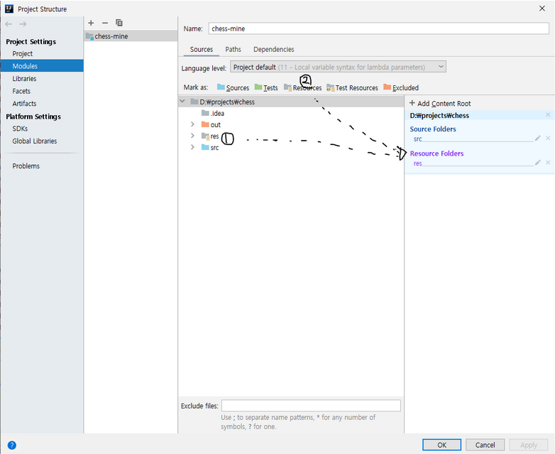

# Chess game with Swing GUI

## Summary
This is term project of Computer science (2019 Fall) of Yonsei University(YSU). 
It has been tested and can be compiled by JDK 11.

## How to compile or run
Its important to add the /res folder as project resources in Intellij to be able to compile this project.
But since I have added the compiled folder. You can run /out/production/Chessgame/Launcher with your preferable JRE to test the game.

## The implemented features:
- Timer
- Check
- Mate
- Save/Load the current game
- Promotion of the pawns
- Move guide with for players 
## Feature roadmap
- Countdown
- Network gaming
- AI (Easy/Medium/Hard)
## Contributing
Pull requests are welcome. For major changes, please open an issue first to discuss what you would like to change.
Please make sure to update tests as appropriate.
## Authors:
* **Dani**
## License
"THE BEER-WARE LICENSE"

